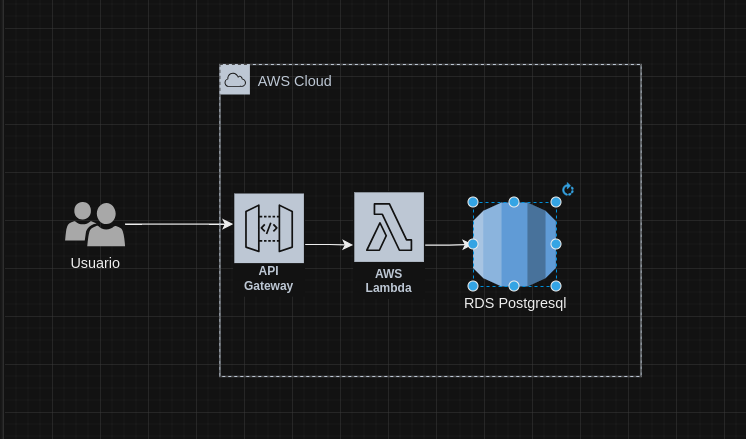

**1)** Definição inicial da estrutura do projeto

O projeto está estruturado da seguinte forma


```
.
├── app
│   ├── api.py
│   ├── compose                -- Diretorio de arquitetura em docker
│   │   ├── compose-db.yml
│   │   ├── compose-dev.yml
│   │   └── table.sql
│   ├── config.py
│   ├── Dockerfile             
│   ├── log                    -- Diretorio de logs
│   ├── requirements.txt
│   ├── settings.toml          -- Arquivo de configuração
│   └── src                    -- Diretorio dos modulos
│       ├── db.py
│       ├── __init__.py
│       └── routes.py
├── terraform                  -- Diretorio de arquitetura em terraform
├── imagens                    -- Diretorio de imagens
├── COMMENTS.md
├── Makefile
└── README.md
```

**2)** Organização do codigo deixando mais modularizado, utilizando as bibilotecas
- **dynaconf** -- biblioteca de configuração de variáveis 
- **pyscopg2** -- biblioteca de conexão com o banco de dados PostgreSQL

**3)** Preparando a api para salvar e consultar os comentários em um banco de dados **POSTGRESL**

**4)** Definindo o projeto para uso em container

**5)** Criando do compose para o banco de dados e o script inicial para criar a tabela

**6)** Criando do compose para ambiente dev para subir tanto como a API e o banco localmente

**7)** Criando a estrutura inicial para o terraform

**8)** Definição da arquitetura do projeto na AWS

**8.1)** Desenho Arquitetura LAMBDA



**8.2)** Desenho Arquitetura FARGATE


**9)** Estrutura inicial do Jenkinsfile